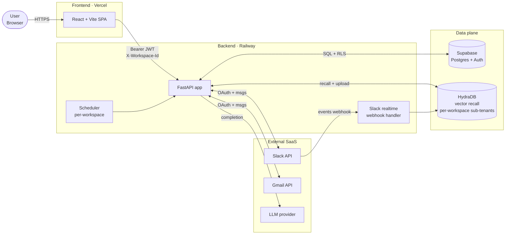
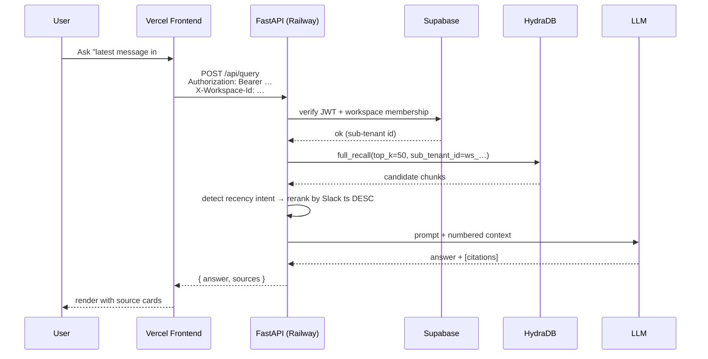
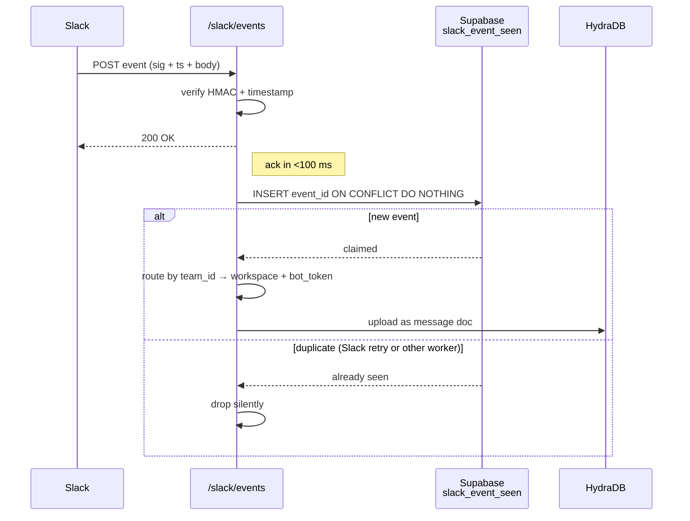

# Second Brain MVP

> A multi-workspace retrieval app that turns your Slack threads and Gmail labels into a searchable, citation-backed second brain.

[](#stack)
[](#stack)
[](#stack)
[](#deployment)
[](#deployment)
[](#testing)
[](#testing)
[](#license)

Second Brain ingests your team's Slack conversations and Gmail threads, isolates them per workspace, and answers natural-language questions with cited sources — including realtime "what is the latest message in #engineering" lookups.

Built for small teams that want LLM recall over their own communications without sending raw data through someone else's chatbot product.

---

## Table of contents

- [Highlights](#highlights)
- [Stack](#stack)
- [Architecture](#architecture)
- [How it works](#how-it-works)
- [Screenshots](#screenshots)
- [Local setup](#local-setup)
- [Environment variables](#environment-variables)
- [Supabase setup](#supabase-setup)
- [Slack app setup](#slack-app-setup)
- [Gmail OAuth setup](#gmail-oauth-setup)
- [Running the app](#running-the-app)
- [Deployment](#deployment)
- [Project structure](#project-structure)
- [API overview](#api-overview)
- [Security notes](#security-notes)
- [Troubleshooting](#troubleshooting)
- [Roadmap](#roadmap)
- [Contributing](#contributing)
- [License](#license)

---

## Highlights

- **Multi-workspace by design.** Every API call is scoped by a Supabase JWT plus an `X-Workspace-Id` header. Slack installations, Gmail connections, and HydraDB sub-tenants are partitioned per workspace.
- **Two connectors.**
  - **Slack** — workspace-level OAuth, per-channel selection, manual + realtime + scheduled ingestion.
  - **Gmail** — per-workspace OAuth with support for **multiple Gmail accounts** per workspace, label-based selection, manual ingestion.
- **Recall that does what you mean.**
  - Semantic search via HydraDB for "what did we decide about Kafka?"
  - Automatic **recency mode** for "what is the latest message in #engineering" — sorts by Slack timestamp instead of semantic score.
  - Channel + person + date filters extracted from natural language.
- **Production hardening.**
  - Slack webhook idempotency backed by a durable Supabase table (survives restarts and multi-worker deploys).
  - Structured logs with `request_id` / `user_id` / `workspace_id` / `correlation_id`.
  - Per-bucket rate limiting (`auth`, `query`, `slack_webhook`, `ingest`).
  - Dead-letter logging + exponential-backoff retries on background jobs.
  - Optional Sentry integration; readiness probe covers Supabase, HydraDB, and the LLM provider.
- **Saved answers, source citations, chat history**, theming, keyboard shortcuts.

---

## Stack

| Layer            | Tooling                                                  |
| ---------------- | -------------------------------------------------------- |
| Frontend         | React 18 + Vite + plain CSS                              |
| Backend          | FastAPI + Pydantic v2 + supabase-py                      |
| Auth + Database  | Supabase (Postgres + Auth + RLS)                         |
| Retrieval        | HydraDB (vector recall) with workspace-scoped sub-tenants |
| LLM              | OpenAI-compatible provider (OpenAI / OpenRouter / etc.)   |
| Frontend hosting | Vercel                                                   |
| Backend hosting  | Railway (Render / Fly / Docker also supported)           |
| Observability    | Sentry (opt-in) + structured stdout logs                  |

---

## Architecture



### Request lifecycle



---

## How it works

### 1. OAuth (Slack + Gmail)

OAuth flows are workspace-scoped. Before redirecting the user to the provider's consent screen, the backend mints an **HMAC-signed state token** that binds:

- `workspace_id` (so the callback can't be replayed against another workspace)
- `user_id` (audit + downstream `installed_by`)
- a 5-minute `exp`
- a random `nonce`

The callback has no `Authorization` header — Google/Slack can't send one — so the signed state is the only authoritative way to know which workspace this install belongs to. Tampering breaks the HMAC, expiry blocks replay attacks, and a separate state secret per connector (`SLACK_OAUTH_STATE_SECRET`, `GMAIL_OAUTH_STATE_SECRET`) means a leak of one doesn't compromise the other.

Tokens (Slack `bot_token`, Google `refresh_token`/`access_token`) are persisted in Supabase tables that have RLS enabled with **no policies** — only the service-role backend can read them. The API never serializes tokens in any response body.

### 2. Ingestion

#### Slack — manual

`POST /api/slack/ingest` resolves the workspace's selected channels, pulls each channel's new messages since the last watermark, builds one markdown doc per message/thread, and uploads to HydraDB under the workspace's sub-tenant id. Each per-channel pass has a retry + dead-letter wrapper so a single bad channel can't fail the whole run.

#### Slack — realtime

Slack delivers `message` events to `POST /slack/events`. The handler:

1. Verifies the HMAC signature against `SLACK_SIGNING_SECRET` with a timestamp tolerance.
2. Acks immediately (Slack times out at 3s).
3. Hands the event to the background worker.



The two-tier dedupe (process-local cache in front of the Supabase claim) means duplicates survive both restarts and multi-worker deployments, while still being microseconds-fast on the hot path.

#### Gmail

`POST /api/gmail/ingest` runs per-connection: for each selected label, it lists the most recent message ids (capped at `GMAIL_MAX_MESSAGES_PER_RUN`, default 100), fetches each message via `users.messages.get?format=full`, converts the payload to markdown (subject, from, to, cc, date, labels, snippet, body text, Gmail message id, permalink), and uploads to the workspace's HydraDB sub-tenant. `SPAM` and `TRASH` are blocked by default unless `GMAIL_ALLOW_SPAM_TRASH=true`.

Stable dedupe key for every email: `gmail:msg:{message_id}`.

### 3. Retrieval

`prepare_recall_context` is the single place where ranking happens:

1. **Recency-intent detection** — if the question contains a recency cue (`latest`, `newest`, `most recent`, `last`) AND a Slack-message noun (`message`, `post`, `chat`, `ping`, `slack`), the candidate pool is widened (default 50) and the surviving Slack-message chunks are sorted by Slack timestamp DESC.
2. **Channel filter** — `#engineering` and `engineering` both match the stored channel name `engineering`.
3. **Semantic / exact / hybrid modes** apply when recency intent doesn't fire. Metadata bias (weak person/channel inference) gives matching chunks a ranking boost without hard-filtering.

When the recency rerank finds no Slack chunks with timestamps (e.g. Gmail-only workspace), the pipeline falls back to semantic mode so the question still gets answered.

### 4. Answer generation

Reranked chunks become numbered `[1]`, `[2]`, … blocks in the prompt. The LLM is instructed to cite the `[N]` for every claim. The response includes a parallel `sources[]` array with channel + permalink + timestamp + snippet so the UI can render rich source cards. Citation tags that don't correspond to any surviving source are stripped server-side.

---

## Screenshots

> *(Replace these placeholders with real images in `docs/screenshots/`.)*

| | |
| --- | --- |
|  |  |
| *Main chat view with source citations* | *Saved answers panel* |
|  |  |
| *Slack channel picker* | *Gmail label picker (multi-account)* |

---

## Local setup

### Prerequisites

- Node 20+
- Python 3.12+
- A Supabase project (free tier is fine)
- A HydraDB tenant + API key
- An OpenAI-compatible API key
- (Optional, for connectors) Slack app credentials + Google OAuth credentials

### Clone

```bash
git clone https://github.com/your-org/second-brain-mvp.git
cd second-brain-mvp
```

### Backend

```bash
cd backend
python3 -m venv .venv && source .venv/bin/activate
pip install -r requirements.txt
cp .env.example .env
# edit .env with your secrets
```

### Frontend

```bash
cd frontend
npm install
cp .env.example .env.local
# edit .env.local — point VITE_API_BASE_URL at your backend
```

---

## Environment variables

### Backend (`backend/.env`)

```bash
# ─── Core ────────────────────────────────────────────────────────────
ENVIRONMENT=local                  # set to "production" on Railway
APP_API_KEY=replace-with-a-long-random-string
CORS_ORIGINS=http://localhost:5173
FRONTEND_BASE_URL=http://localhost:5173
LOG_LEVEL=INFO

# ─── Supabase ────────────────────────────────────────────────────────
SUPABASE_URL=https://your-project.supabase.co
SUPABASE_JWT_SECRET=your-supabase-jwt-secret
SUPABASE_SERVICE_ROLE_KEY=your-supabase-service-role-key

# ─── HydraDB (vector recall) ─────────────────────────────────────────
HYDRADB_API_KEY=your-hydradb-key
HYDRADB_TENANT_ID=your-tenant-id

# ─── LLM provider (OpenAI-compatible) ────────────────────────────────
OPENAI_API_KEY=your-openai-key
# OPENAI_BASE_URL=https://openrouter.ai/api/v1   # optional override
# LLM_MODEL=gpt-4o-mini                          # optional override

# ─── Slack Connect ───────────────────────────────────────────────────
SLACK_CLIENT_ID=your-slack-client-id
SLACK_CLIENT_SECRET=your-slack-client-secret
SLACK_REDIRECT_URI=http://127.0.0.1:8000/api/slack/oauth/callback
SLACK_OAUTH_STATE_SECRET=generate-a-long-random-string
SLACK_SIGNING_SECRET=your-slack-signing-secret

# ─── Gmail Connect (Phase 8, optional) ───────────────────────────────
GMAIL_CLIENT_ID=
GMAIL_CLIENT_SECRET=
GMAIL_REDIRECT_URI=http://127.0.0.1:8000/api/gmail/oauth/callback
GMAIL_OAUTH_STATE_SECRET=
GMAIL_MAX_MESSAGES_PER_RUN=100
GMAIL_ALLOW_SPAM_TRASH=false

# ─── Observability (optional) ────────────────────────────────────────
SENTRY_DSN=
SENTRY_TRACES_SAMPLE_RATE=0.1
```

Generate the random secrets in one line:

```bash
python -c "import secrets; print(secrets.token_hex(32))"
```

### Frontend (`frontend/.env.local`)

```bash
VITE_API_BASE_URL=http://127.0.0.1:8000
VITE_SUPABASE_URL=https://your-project.supabase.co
VITE_SUPABASE_ANON_KEY=your-supabase-anon-key
```

---

## Supabase setup

1. Create a Supabase project. Note the `URL`, `anon key`, `service role key`, and `JWT secret` (under **Settings → API**).
2. Apply the SQL migrations in order. They are idempotent:

   ```bash
   cd backend/supabase
   psql "$SUPABASE_DB_URL" -f schema.sql
   psql "$SUPABASE_DB_URL" -f phase2_chat_and_saved.sql
   psql "$SUPABASE_DB_URL" -f phase3_slack_connect.sql
   psql "$SUPABASE_DB_URL" -f phase4_hydradb_workspace_isolation.sql
   psql "$SUPABASE_DB_URL" -f phase7_production_hardening.sql
   psql "$SUPABASE_DB_URL" -f phase8_gmail_connector.sql
   ```

   *Or* paste them sequentially into the Supabase SQL editor.

3. Enable email auth (or any provider you want) under **Authentication → Providers**.
4. After applying changes, run `NOTIFY pgrst, 'reload schema'` so PostgREST picks up new columns.

---

## Slack app setup

1. Create a Slack app at <https://api.slack.com/apps>.
2. Under **OAuth & Permissions**, add the bot token scopes:
   - `channels:history`
   - `channels:read`
   - `groups:history`
   - `groups:read`
   - `users:read`
3. Set the redirect URL to `SLACK_REDIRECT_URI` (must be HTTPS in production).
4. Under **Event Subscriptions**:
   - Request URL: `https://your-backend.example.com/slack/events`
   - Subscribe to bot events: `message.channels`, `message.groups`.
5. Copy **Client ID**, **Client Secret**, and **Signing Secret** into the backend env.
6. Install the app to a test workspace and invite the bot to the channels you want to ingest.

---

## Gmail OAuth setup

1. In <https://console.cloud.google.com/apis/credentials>, create an **OAuth client ID** of type **Web application**.
2. Add `GMAIL_REDIRECT_URI` to the **Authorized redirect URIs** list.
3. Enable the **Gmail API** for the project (APIs & Services → Library).
4. Add yourself as a test user under **OAuth consent screen → Test users** (skip publishing for MVP).
5. Copy **Client ID** and **Client Secret** into the backend env.

Scopes the connector requests (read-only — we never modify or send mail):

```
openid  email  profile  https://www.googleapis.com/auth/gmail.readonly
```

---

## Running the app

In two terminals:

```bash
# terminal 1 — backend
cd backend && source .venv/bin/activate
uvicorn main:app --reload --host 127.0.0.1 --port 8000
```

```bash
# terminal 2 — frontend
cd frontend
npm run dev
```

Visit <http://localhost:5173>, sign up with Supabase auth, create or join a workspace, and connect a Slack workspace or a Gmail account from the top nav.

### Tests

```bash
cd backend && python3 -m pytest tests/ --cov=. --cov-fail-under=85
```

```bash
cd frontend && npm run build
```

---

## Deployment

### Backend on Railway

1. Create a new Railway project. Link it to this repo or to `backend/` as the deploy root.
2. Use the included `Dockerfile` (Python 3.12 + uvicorn).
3. Set every variable from `backend/.env.example` in the Railway **Variables** tab. **`ENVIRONMENT=production`** is required — it triggers an extra startup audit that:
   - Refuses to boot with a `localhost` CORS origin.
   - Refuses to boot if `SLACK_REDIRECT_URI` isn't HTTPS.
   - Refuses to boot if any secret still looks like a `.env.example` placeholder.
4. Health probe: point Railway at `GET /api/health`. Liveness: `200`. For readiness use `GET /api/ready` — it returns `503` when Supabase / HydraDB / the LLM provider is unreachable.
5. Cron / scheduler: the backend's in-process scheduler runs ingestion passes per workspace. If you scale to >1 replica, disable the in-process scheduler and run it as a single Railway scheduled job instead.

### Frontend on Vercel

1. Import the repo into Vercel. Set the **Root Directory** to `frontend`.
2. Build command: `npm run build`. Output directory: `dist`.
3. Set the env vars:

   ```bash
   VITE_API_BASE_URL=https://your-backend.up.railway.app
   VITE_SUPABASE_URL=https://your-project.supabase.co
   VITE_SUPABASE_ANON_KEY=your-anon-key
   ```

4. After the first deploy, copy the Vercel URL back to the backend's `CORS_ORIGINS` and `FRONTEND_BASE_URL`, and add it as a Slack/Google OAuth redirect URI base.

### Supabase in production

- Enable **email confirmation** under Authentication.
- Verify RLS is enabled on every table — the migrations do this, but it's worth confirming under **Database → Tables**.
- Schedule the dedupe-table cleanup (it's optional but tidy):

  ```sql
  select cron.schedule(
    'cleanup-slack-event-seen',
    '0 4 * * *',                                   -- 04:00 UTC daily
    $$ select public.cleanup_slack_event_seen(24); $$
  );
  ```

---

## Project structure

```
second-brain-mvp/
├── README.md
├── DEPLOYMENT.md                  # extra deployment recipes
├── render.yaml                    # alt deploy spec (Render)
├── backend/
│   ├── Dockerfile
│   ├── docker-compose.yml
│   ├── pyproject.toml
│   ├── requirements.txt
│   ├── requirements-dev.txt
│   ├── setup.cfg
│   ├── .env.example
│   ├── main.py                    # FastAPI app + routes
│   ├── auth.py                    # legacy API-key auth (admin only)
│   ├── auth_supabase.py           # Supabase JWT verification + workspace binding
│   ├── supabase_client.py         # all Supabase CRUD helpers
│   ├── startup.py                 # env validation + secrets audit
│   ├── logging_config.py          # structured logs + request context
│   ├── request_context.py
│   ├── rate_limit.py              # per-bucket sliding-window limiter
│   ├── observability.py           # Sentry hooks + dep checks + dead-letter
│   ├── retry.py                   # exponential-backoff helper
│   ├── errors.py
│   ├── hydradb_client.py          # vector recall client
│   ├── recall.py                  # prepare_recall_context, recency rerank
│   ├── search_utils.py            # rerank / dedupe / keyword scoring
│   ├── query_rewriter.py          # person + channel inference
│   ├── query_cache.py
│   ├── prompts.py
│   ├── llm.py
│   ├── slack_oauth.py             # Slack OAuth + channel fetch + ingest runner
│   ├── slack_signature.py         # HMAC verification for /slack/events
│   ├── realtime_ingest.py         # Slack webhook → HydraDB pipeline
│   ├── gmail_oauth.py             # Gmail OAuth + label/message fetch + ingest
│   ├── scheduler.py               # per-workspace background pass
│   ├── date_utils.py
│   ├── ingestion/
│   │   ├── ingest_slack.py        # message → markdown builder
│   │   └── …
│   ├── supabase/
│   │   ├── schema.sql                              # workspaces + members + profiles
│   │   ├── phase2_chat_and_saved.sql               # chat sessions + saved answers
│   │   ├── phase3_slack_connect.sql                # slack_installations + slack_channels
│   │   ├── phase4_hydradb_workspace_isolation.sql  # sub-tenant naming + tracking
│   │   ├── phase7_production_hardening.sql         # slack_event_seen dedupe
│   │   └── phase8_gmail_connector.sql              # gmail_connections / _labels / _ingestion_state
│   └── tests/
│       ├── conftest.py
│       ├── test_recall_recency.py
│       ├── test_slack_oauth.py
│       ├── test_slack_channels.py
│       ├── test_gmail_oauth.py
│       ├── test_gmail_routes.py
│       ├── test_gmail_isolation.py
│       ├── test_phase4_isolation.py
│       ├── test_phase7_hardening.py
│       └── …
└── frontend/
    ├── package.json
    ├── vite.config.js
    ├── index.html
    ├── .env.example
    └── src/
        ├── main.jsx
        ├── App.jsx
        ├── api.js
        ├── styles.css
        ├── lib/
        │   └── supabase.js
        ├── auth/
        │   ├── AuthContext.jsx
        │   ├── AuthGate.jsx
        │   ├── AuthForm.jsx
        │   ├── WorkspaceContext.jsx
        │   └── WorkspaceSwitcher.jsx
        ├── slack/
        │   └── SlackSettings.jsx
        └── gmail/
            └── GmailSettings.jsx
```

---

## API overview

Every route below requires:

- `Authorization: Bearer <supabase_jwt>`
- `X-Workspace-Id: <workspace_uuid>`

…with the exception of `/api/me*`, the OAuth callbacks, `/api/health`, `/api/ready`, and `/slack/events`.

### Identity + workspaces

```http
GET    /api/me
GET    /api/me/workspaces
```

### Query

```http
POST   /api/query
POST   /api/query/stream          # Server-Sent Events
```

Example:

```bash
curl -X POST "$API/api/query" \
  -H "Authorization: Bearer $JWT" \
  -H "X-Workspace-Id: $WS" \
  -H "Content-Type: application/json" \
  -d '{"question":"what is the latest message in #engineering"}'
```

Response shape:

```json
{
  "answer":  "The latest message in #engineering says PROD REALTIME FINAL TEST 12345 23:15 [1].",
  "sources": [
    {
      "index":     1,
      "channel":   "engineering",
      "timestamp": "1740000000.000",
      "permalink": "https://your-team.slack.com/archives/C1/p1740000000000",
      "snippet":   "PROD REALTIME FINAL TEST 12345 23:15"
    }
  ],
  "retrieval_mode": "recency"
}
```

### Slack Connect

```http
GET    /api/slack/connect-url
GET    /api/slack/oauth/callback             # public; HMAC-signed state
GET    /api/slack/channels
POST   /api/slack/channels                   # { selected_channel_ids: [...] }
POST   /api/slack/ingest
POST   /slack/events                         # public; signature-verified webhook
```

### Gmail Connect

```http
GET    /api/gmail/connect-url
GET    /api/gmail/oauth/callback             # public; HMAC-signed state
GET    /api/gmail/connections
DELETE /api/gmail/connections/{id}
GET    /api/gmail/labels?connection_id=...
POST   /api/gmail/labels                     # { connection_id, selected_label_ids }
POST   /api/gmail/ingest                     # { connection_id }
```

### Chat history + saved answers

```http
GET    /api/chat/sessions
GET    /api/chat/sessions/{id}/messages
POST   /api/chat/sessions
GET    /api/saved-answers
POST   /api/saved-answers
DELETE /api/saved-answers/{id}
```

### Probes

```http
GET    /api/health                  # liveness — always 200 once boot finishes
GET    /api/ready                   # readiness — 503 when deps unhealthy
```

---

## Security notes

- **Tokens never leave the backend.** Slack `bot_token` and Google `refresh_token` / `access_token` live in Supabase tables with RLS enabled and **no policies** — only the service-role backend can read them. The public projection helpers strip token fields before any API response.
- **OAuth state is HMAC-signed** with a per-connector secret and a 5-minute expiry. Tampering breaks the signature; replay is blocked by expiry. The callback derives the target workspace from the *signed* state, never from a header.
- **RLS everywhere.** Every workspace-scoped table has policies that gate access on `workspace_members`. Even if the JWT verification on the backend were bypassed, RLS would still reject cross-workspace reads.
- **Webhook signatures.** `/slack/events` verifies the HMAC over the raw body before parsing JSON, with a timestamp tolerance to defeat replays.
- **Idempotency at scale.** The Slack dedupe is two-tier — a process-local cache in front of `INSERT … ON CONFLICT DO NOTHING` against `slack_event_seen`. Duplicates survive restarts and multi-worker deploys.
- **Spam/Trash protection.** Gmail labels `SPAM` and `TRASH` are blocked at the ingest runner unless `GMAIL_ALLOW_SPAM_TRASH=true`.
- **No body/token logging.** Email bodies, message bodies, and tokens are deliberately excluded from log lines. Failed Supabase upserts log the structured PostgREST error body (`code`, `message`, `hint`, `details`) — never the row values.
- **Per-bucket rate limits.** `auth=30/5min`, `query=20/5min`, `slack_webhook=600/5min`, `ingest=5/5min`. A flood in one bucket can't starve another.
- **Production env audit.** `ENVIRONMENT=production` refuses to boot with `localhost` CORS, http redirect URIs, or placeholder secrets.

---

## Troubleshooting

| Symptom | Likely cause | Fix |
| --- | --- | --- |
| `?slack_connect=error&reason=persist_failed` after OAuth | Production schema uses `scope` (singular), code sending `scopes` | Already fixed — column-aligned in `phase3_slack_connect.sql`. If you see this on an existing DB, re-run that migration. |
| `supabase_upsert_channels_failed` after Slack connect | `slack_channels.installation_id` is NOT NULL; older code didn't send it | Already fixed — the channel upsert now forwards `installation_id`. Re-run `phase3_slack_connect.sql`. |
| Query returns an older message for "latest message" | Pure semantic recall outranked the newest message | Already fixed — recency intent now widens the candidate pool to 50 and reranks by Slack timestamp DESC. |
| `503` on `/api/ready` | One of Supabase / HydraDB / OpenAI is unreachable | Check the body — each dep is reported separately with `latency_ms` and `reason`. |
| Slack events arrive but nothing ingests | Bot not invited to the channel | Invite the bot, then `Refresh` in the Slack panel. |
| "Gmail OAuth is not configured" | Backend missing `GMAIL_CLIENT_ID` etc. | Set the four Gmail env vars and restart. The connector is opt-in. |
| Frontend stuck at "Loading…" with 401 in console | Bearer token expired and refresh didn't run | Refresh the page. If persistent, sign out and back in — Supabase's auto-refresh sometimes needs a session reset. |
| New table columns missing in API responses | PostgREST schema cache stale | Run `NOTIFY pgrst, 'reload schema';` against the Supabase DB. |
| `column "scopes" does not exist` | Old migration drift | Re-run `phase3_slack_connect.sql` — it adds `scope` defensively and never drops data. |

---

## Roadmap

- [ ] Gmail realtime via [push notifications](https://developers.google.com/gmail/api/guides/push)
- [ ] Notion connector (read-only)
- [ ] Linear / GitHub Issues connector
- [ ] Per-workspace LLM provider override
- [ ] In-app workspace billing
- [ ] Recall over attachments (PDFs, slides) via OCR pre-stage
- [ ] Encrypted token storage with `pgsodium`
- [ ] Multi-tenant scheduler with leader election (replaces in-process scheduler at >1 replica)
- [ ] Public Postman collection + OpenAPI publishing
- [ ] Frontend code-splitting (bundle is currently ~565 kB un-gzipped)

---

## Contributing

Contributions welcome. A few ground rules:

1. **Tests before merge.** Backend coverage gate is 85%. New routes need tests for happy-path, auth, workspace isolation, and the failure mode.
2. **Schema migrations are idempotent.** Every new SQL file uses `create table if not exists` + `add column if not exists` + `do $$ … exception when others then null; end $$` for constraints. Never drop a column on an existing database.
3. **Log structure, not strings.** Use `logger.info("event_name", extra={...})` so logs stay parseable.
4. **Never log tokens or message bodies.** When in doubt, log an ID or a length.
5. **Pydantic models use `ConfigDict(extra="forbid")`** so a typo in a request body becomes a 422 instead of a silent no-op.

### Dev loop

```bash
# Backend tests
cd backend && python3 -m pytest tests/ -q

# Backend with hot-reload
uvicorn main:app --reload

# Frontend with hot-reload
cd frontend && npm run dev

# Frontend prod build (validates type errors + bundle)
npm run build
```

### File layout conventions

- `backend/<feature>_oauth.py` — OAuth + provider API client + ingestion runner for one connector.
- `backend/supabase/phaseN_<thing>.sql` — additive, idempotent migrations.
- `backend/tests/test_<feature>_<aspect>.py` — one file per aspect (oauth / routes / isolation / hardening).
- `frontend/src/<feature>/<Feature>Settings.jsx` — the in-app picker UI for one connector.

---

## License

MIT. See [`LICENSE`](LICENSE) for the full text.

---

*Built with FastAPI, React, Supabase, and HydraDB. Made for teams that want their own data back.*